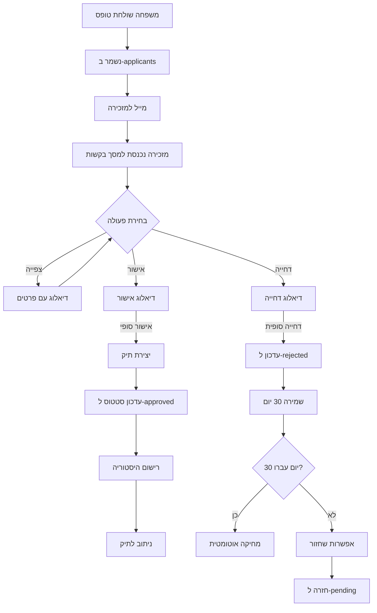

# מסמך אפיון - מודול יצירת תיק חתונה

**תאריך:** אוקטובר 2025
**גרסה:** 1.0
**סוג מודול:** Wedding Cases - Case Creation
**סטטוס:** Draft - ממתין לאישור

---

## תוכן עניינים

1. [מטרת המסמך](#1-מטרת-המסמך)
2. [תזרים עבודה (Workflow)](#2-תזרים-עבודה-workflow)
3. [דרישות פונקציונליות](#3-דרישות-פונקציונליות)
4. [מבנה נתונים והמרות](#4-מבנה-נתונים-והמרות)
5. [ממשקי משתמש (UI/UX)](#5-ממשקי-משתמש-uiux)
6. [API Endpoints](#6-api-endpoints)
7. [טיפול בשגיאות וקצוות](#7-טיפול-בשגיאות-וקצוות)
8. [עקרונות SOLID ואבטחה](#8-עקרונות-solid-ואבטחה)
9. [שלבי יישום](#9-שלבי-יישום)

---

## 1. מטרת המסמך

מסמך זה מפרט את **מודול יצירת תיק חתונה** - השלב שבו בקשה (applicant) מתקבלת, נבדקת, מאושרת ע"י מזכירה, והופכת לתיק רשמי (case) במערכת.

### 1.1 Scope (היקף)

**כלול במסמך זה:**
- תהליך אישור/דחיה של בקשות חתונה
- יצירת תיק חתונה מאושר
- ניהול מספרי תיקים רצים
- ממשק למזכירה לניהול בקשות ממתינות
- היסטוריה של בקשות נדחות (30 יום)

**לא כלול במסמך זה:**
- תיקי ניקיון (ילדים חולים)
- ניהול תיק קיים (עריכה, קבצים, תשלומים)
- טופס חיצוני (כבר מוכן)

---

## 2. תזרים עבודה (Workflow)

### 2.1 תרשים זרימה כללי

```
┌─────────────────────────────────────────────────────────────────┐
│  1. משפחה ממלאת טופס חתונה חיצוני                               │
│     ↓                                                            │
│  2. טופס נשמר ב-applicants (status: 'pending_approval')         │
│     ↓                                                            │
│  3. מייל נשלח למזכירה: "בקשה חדשה התקבלה"                      │
│     ↓                                                            │
│  ┌──────────────────────────────────────────┐                   │
│  │ 4. מזכירה נכנסת למסך "בקשות ממתינות"   │                   │
│  │    - רואה את כל הבקשות                  │                   │
│  │    - לוחצת על בקשה לצפייה               │                   │
│  └──────────────────────────────────────────┘                   │
│                    │                                             │
│         ┌──────────┴──────────┐                                 │
│         │                     │                                 │
│    [אישור]                [דחייה]                               │
│         │                     │                                 │
│         ↓                     ↓                                 │
│  ┌─────────────────┐   ┌─────────────────┐                     │
│  │ 5a. יצירת תיק    │   │ 5b. סימון כנדחה │                     │
│  │ - מספר רץ מ-7000 │   │ - שמירה 30 יום  │                     │
│  │ - סטטוס: 'new'  │   │ - אפשרות החזרה  │                     │
│  │ - העתקת נתונים   │   └─────────────────┘                     │
│  └─────────────────┘                                            │
│         ↓                                                        │
│  6. ניתוב אוטומטי למסך התיק החדש                               │
│                                                                  │
└─────────────────────────────────────────────────────────────────┘
```

### 2.2 סטטוסים במערכת

#### Applicant Statuses (טבלת applicants)
| סטטוס | ערך ב-DB | תיאור | משך זמן |
|-------|----------|-------|---------|
| **ממתין לאישור** | `pending_approval` | בקשה חדשה, טרם נבדקה | עד אישור/דחייה |
| **אושר** | `approved` | הפך לתיק במערכת | קבוע |
| **נדחה** | `rejected` | נדחה ע"י מזכירה | 30 יום ואז מחיקה |

#### Case Statuses (טבלת cases)
| סטטוס | ערך ב-DB | תיאור | משך זמן |
|-------|----------|-------|---------|
| **חדש** | `new` | תיק נפתח זה עתה | 2 ימים (אופציונלי) |
| **ממתין להעברה** | `pending_transfer` | אושר תשלום | עד העברה בפועל |
| **הועבר** | `transferred` | כסף הועבר | קבוע |
| **נדחה** | `rejected` | תיק נדחה | קבוע |
| **פג תוקף** | `expired` | עבר תאריך החתונה | קבוע |

> **הערה:** בשלב זה מתמקדים רק בסטטוס `new` בעת יצירת תיק.

---

## 3. דרישות פונקציונליות

### 3.1 מסך "בקשות ממתינות" (Pending Applicants)

#### 3.1.1 תצוגה ראשית

**מבנה המסך:**

```
┌──────────────────────────────────────────────────────────────┐
│  📊 סיכום בקשות ממתינות                                      │
│  ─────────────────────────────────────────────────────────   │
│  🔵 5 ממתינות לאישור  |  ✅ 12 אושרו השבוע  |  ❌ 3 נדחו   │
└──────────────────────────────────────────────────────────────┘

┌──────────────────────────────────────────────────────────────┐
│  🔍 סינונים וחיפוש                                          │
│  [סטטוס ▼]  [עיר ▼]  [תאריך ▼]  [חיפוש...]  [🔄 רענן]    │
└──────────────────────────────────────────────────────────────┘

┌──────────────────────────────────────────────────────────────┐
│  📋 טבלת בקשות                                               │
│  ─────────────────────────────────────────────────────────   │
│  [כל העמודות...]                                             │
└──────────────────────────────────────────────────────────────┘
```

**סטטיסטיקות עליונות (סולידיות):**

```tsx
// עיצוב מינימלי וסולידי
<div className="mb-6 rounded-lg border-2 border-slate-200 bg-white shadow-sm p-4">
  <div className="flex items-center justify-between">
    <h3 className="text-sm font-semibold text-slate-600">סיכום בקשות</h3>
  </div>
  <div className="mt-3 grid grid-cols-3 gap-4">
    <div className="text-center">
      <div className="text-2xl font-bold text-blue-600">5</div>
      <div className="text-xs text-slate-500 mt-1">ממתינות לאישור</div>
    </div>
    <div className="text-center border-x-2 border-slate-200">
      <div className="text-2xl font-bold text-green-600">12</div>
      <div className="text-xs text-slate-500 mt-1">אושרו השבוע</div>
    </div>
    <div className="text-center">
      <div className="text-2xl font-bold text-red-600">3</div>
      <div className="text-xs text-slate-500 mt-1">נדחו</div>
    </div>
  </div>
</div>
```

**טבלת בקשות:**

| עמודה | תוכן | ניתן למיון | ניתן לסינון |
|-------|------|-----------|-------------|
| תאריך קבלה | `created_at` | ✅ | ✅ |
| שם החתן | `groom_first_name + groom_last_name` | ✅ | ✅ |
| שם הכלה | `bride_first_name + bride_last_name` | ✅ | ✅ |
| תאריך חתונה | `wedding_date_hebrew` + `wedding_date_gregorian` | ✅ | ✅ |
| עיר | `city` | ✅ | ✅ |
| כמות מוזמנים | `guests_count` | ✅ | ❌ |
| סטטוס | `status` (badge עם צבע) | ❌ | ✅ |
| פעולות | כפתורים: צפייה, אישור, דחייה | ❌ | ❌ |

**סינונים:**
- לפי סטטוס: [ממתין לאישור, נדחה]
- לפי טווח תאריכים (קבלת הבקשה)
- לפי עיר (dropdown)
- חיפוש טקסט חופשי (שם חתן/כלה)

**Badges לסטטוס (לפי DESIGN_SYSTEM.md):**
```tsx
// ממתין לאישור - Warning
<Badge className="bg-gradient-to-r from-amber-500 to-amber-600 text-white px-3 py-1 text-xs font-semibold">
  ממתין לאישור
</Badge>

// אושר - Success
<Badge className="bg-gradient-to-r from-green-500 to-green-600 text-white px-3 py-1 text-xs font-semibold">
  אושר
</Badge>

// נדחה - Error
<Badge className="bg-gradient-to-r from-red-500 to-red-600 text-white px-3 py-1 text-xs font-semibold">
  נדחה
</Badge>
```

#### 3.1.2 דיאלוג צפייה בבקשה

**כפתור צפייה בטבלה:**

```tsx
// כפתור בשורת הטבלה
<Button
  variant="outline"
  size="sm"
  className="border-2 border-blue-600 text-blue-600 hover:bg-blue-50 font-semibold"
>
  <Eye className="h-4 w-4 me-2" />
  צפייה
</Button>
```

**תוכן הדיאלוג:**

```tsx
<Dialog>
  <DialogContent className="max-w-3xl max-h-[90vh] overflow-y-auto">
    {/* Header */}
    <DialogHeader className="border-b-2 border-slate-200 pb-4">
      <DialogTitle className="text-2xl font-bold bg-gradient-to-r from-blue-600 to-blue-800 bg-clip-text text-transparent">
        📋 בקשה #12345 - חתונה
      </DialogTitle>
      <Badge className="bg-gradient-to-r from-amber-500 to-amber-600 text-white px-3 py-1 w-fit mt-2">
        ממתין לאישור
      </Badge>
    </DialogHeader>

    {/* Content */}
    <div className="space-y-6 py-4">
      {/* מידע על החתונה */}
      <div className="rounded-lg border-2 border-blue-100 bg-blue-50/30 p-4">
        <h3 className="text-lg font-semibold text-blue-900 mb-3 flex items-center gap-2">
          <Calendar className="h-5 w-5" />
          📅 מידע על החתונה
        </h3>
        <div className="grid grid-cols-2 gap-3 text-sm">
          <div>
            <span className="text-slate-600 font-medium">תאריך עברי:</span>
            <span className="text-slate-900 ms-2">כ' בתשרי תשפ"ה</span>
          </div>
          <div>
            <span className="text-slate-600 font-medium">תאריך לועזי:</span>
            <span className="text-slate-900 ms-2">23/10/2024</span>
          </div>
          <div>
            <span className="text-slate-600 font-medium">עיר:</span>
            <span className="text-slate-900 ms-2">ירושלים</span>
          </div>
          <div>
            <span className="text-slate-600 font-medium">כמות מוזמנים:</span>
            <span className="text-slate-900 ms-2">300</span>
          </div>
          <div className="col-span-2">
            <span className="text-slate-600 font-medium">עלות כוללת:</span>
            <span className="text-slate-900 ms-2 font-bold">₪50,000</span>
          </div>
        </div>
      </div>

      {/* פרטי החתן */}
      <div className="rounded-lg border-2 border-slate-200 bg-slate-50/50 p-4">
        <h3 className="text-lg font-semibold text-slate-900 mb-3 flex items-center gap-2">
          <User className="h-5 w-5" />
          👔 פרטי החתן
        </h3>
        <div className="grid grid-cols-2 gap-3 text-sm">
          <div><span className="text-slate-600 font-medium">שם:</span> דוד כהן</div>
          <div><span className="text-slate-600 font-medium">ת.ז.:</span> 123456789</div>
          <div><span className="text-slate-600 font-medium">טלפון:</span> 050-1234567</div>
          <div><span className="text-slate-600 font-medium">מייל:</span> david@example.com</div>
          <div className="col-span-2">
            <span className="text-slate-600 font-medium">כתובת:</span> רחוב הרצל 10, תל אביב
          </div>
          <div className="col-span-2">
            <span className="text-slate-600 font-medium">יום זיכרון:</span> ט' באב
          </div>
        </div>
      </div>

      {/* פרטי הכלה */}
      <div className="rounded-lg border-2 border-slate-200 bg-slate-50/50 p-4">
        <h3 className="text-lg font-semibold text-slate-900 mb-3 flex items-center gap-2">
          <User className="h-5 w-5" />
          👰 פרטי הכלה
        </h3>
        <div className="grid grid-cols-2 gap-3 text-sm">
          <div><span className="text-slate-600 font-medium">שם:</span> שרה לוי</div>
          <div><span className="text-slate-600 font-medium">ת.ז.:</span> 987654321</div>
          <div><span className="text-slate-600 font-medium">טלפון:</span> 050-9876543</div>
          <div><span className="text-slate-600 font-medium">מייל:</span> sarah@example.com</div>
          <div className="col-span-2">
            <span className="text-slate-600 font-medium">כתובת:</span> רחוב הנביאים 5, ירושלים
          </div>
          <div className="col-span-2">
            <span className="text-slate-600 font-medium">יום זיכרון:</span> כ' בשבט
          </div>
        </div>
      </div>

      {/* JSON גולמי (collapsible) */}
      <Collapsible>
        <CollapsibleTrigger className="flex items-center gap-2 text-sm text-slate-600 hover:text-slate-900">
          <ChevronDown className="h-4 w-4" />
          📄 הצג JSON מלא
        </CollapsibleTrigger>
        <CollapsibleContent className="mt-2">
          <pre className="bg-slate-900 text-slate-100 p-4 rounded-lg text-xs overflow-x-auto">
            {JSON.stringify(formData, null, 2)}
          </pre>
        </CollapsibleContent>
      </Collapsible>
    </div>

    {/* Footer - כפתורי פעולה */}
    <DialogFooter className="border-t-2 border-slate-200 pt-4 gap-3">
      <Button
        variant="outline"
        onClick={onClose}
        className="border-2 border-slate-300 hover:bg-slate-50"
      >
        <X className="h-4 w-4 me-2" />
        סגור
      </Button>
      <Button
        variant="outline"
        onClick={onReject}
        className="border-2 border-red-600 text-red-600 hover:bg-red-50 font-semibold"
      >
        <XCircle className="h-4 w-4 me-2" />
        דחה בקשה
      </Button>
      <Button
        onClick={onApprove}
        className="bg-gradient-to-r from-blue-600 to-blue-700 hover:from-blue-700 hover:to-blue-800 shadow-md hover:shadow-lg transition-all"
      >
        <CheckCircle2 className="h-4 w-4 me-2" />
        אשר בקשה
      </Button>
    </DialogFooter>
  </DialogContent>
</Dialog>
```

**כללי תצוגה:**
- תצוגה **לקריאה בלבד** (read-only)
- אין אפשרות לערוך כאן
- הצגה ברורה ומסודרת של כל השדות עם גרדיאנטים עדינים
- JSON גולמי מוסתר כברירת מחדל (ניתן להרחבה)
- צבעים וגבולות לפי DESIGN_SYSTEM.md

#### 3.1.3 אישור בקשה

**Trigger:** כפתור "✅ אשר בקשה"

**תהליך:**

1. **דיאלוג אישור:**

```tsx
<AlertDialog>
  <AlertDialogContent className="max-w-md">
    <AlertDialogHeader>
      <AlertDialogTitle className="text-xl font-bold flex items-center gap-2">
        <CheckCircle2 className="h-6 w-6 text-green-600" />
        אישור יצירת תיק
      </AlertDialogTitle>
      <AlertDialogDescription className="text-base">
        <div className="space-y-3 mt-4">
          <p className="text-slate-700">
            האם לאשר את הבקשה של:
          </p>
          <div className="bg-blue-50 border-2 border-blue-200 rounded-lg p-3">
            <p className="font-bold text-blue-900 text-lg">
              דוד כהן ושרה לוי
            </p>
          </div>
          <p className="text-slate-600 text-sm">
            בקשה זו תהפוך לתיק רשמי במערכת
          </p>
          <div className="bg-slate-100 rounded-lg p-3 border-2 border-slate-200">
            <p className="text-sm">
              <span className="text-slate-600">מספר תיק:</span>
              <span className="font-bold text-slate-900 ms-2">W7001</span>
              <span className="text-slate-500 text-xs ms-2">(אוטומטי)</span>
            </p>
          </div>
        </div>
      </AlertDialogDescription>
    </AlertDialogHeader>
    <AlertDialogFooter className="gap-3">
      <AlertDialogCancel className="border-2 border-slate-300 hover:bg-slate-50">
        <X className="h-4 w-4 me-2" />
        ביטול
      </AlertDialogCancel>
      <AlertDialogAction
        className="bg-gradient-to-r from-green-600 to-green-700 hover:from-green-700 hover:to-green-800 shadow-md hover:shadow-lg transition-all"
      >
        <CheckCircle2 className="h-4 w-4 me-2" />
        כן, אשר
      </AlertDialogAction>
    </AlertDialogFooter>
  </AlertDialogContent>
</AlertDialog>
```

2. **פעולות Backend:**
   - יצירת תיק חדש ב-`cases`
   - מספר תיק רץ (התחלה מ-7000)
   - סטטוס ראשוני: `new`
   - העתקת כל השדות מ-`applicants.form_data`
   - עדכון סטטוס ב-`applicants`: `approved`
   - יצירת רשומה ב-`case_history`: "תיק נוצר מבקשה #XXX"

3. **ניתוב:**
   - **אוטומטי** → מסך התיק החדש (`/cases/wedding/[id]`)
   - הצגת הודעת הצלחה (toast עם גרדיאנט):
   ```tsx
   toast({
     title: (
       <div className="flex items-center gap-2">
         <CheckCircle2 className="h-5 w-5 text-green-600" />
         <span>תיק W7001 נוצר בהצלחה!</span>
       </div>
     ),
     description: "עכשיו אתה מועבר לתיק החדש...",
     className: "border-2 border-green-200 bg-green-50"
   });
   ```

#### 3.1.4 דחיית בקשה

**Trigger:** כפתור "❌ דחה בקשה"

**תהליך:**

1. **דיאלוג דחייה:**

```tsx
<AlertDialog>
  <AlertDialogContent className="max-w-md">
    <AlertDialogHeader>
      <AlertDialogTitle className="text-xl font-bold flex items-center gap-2">
        <XCircle className="h-6 w-6 text-red-600" />
        דחיית בקשה
      </AlertDialogTitle>
      <AlertDialogDescription className="text-base">
        <div className="space-y-4 mt-4">
          <p className="text-slate-700">
            האם לדחות את הבקשה של:
          </p>
          <div className="bg-red-50 border-2 border-red-200 rounded-lg p-3">
            <p className="font-bold text-red-900 text-lg">
              דוד כהן ושרה לוי
            </p>
          </div>

          {/* שדה סיבת דחייה */}
          <div className="space-y-2">
            <Label htmlFor="reason" className="text-sm font-medium text-slate-700">
              סיבת דחייה (אופציונלי)
            </Label>
            <Textarea
              id="reason"
              placeholder="הזן סיבה לדחייה..."
              className="border-2 focus:border-red-500 focus:ring-2 focus:ring-red-200"
              rows={3}
            />
          </div>

          {/* אזהרה */}
          <div className="bg-amber-50 border-2 border-amber-200 rounded-lg p-3 flex items-start gap-2">
            <AlertTriangle className="h-5 w-5 text-amber-600 flex-shrink-0 mt-0.5" />
            <p className="text-sm text-amber-900">
              ניתן לשחזר בקשה נדחית תוך 30 יום
            </p>
          </div>
        </div>
      </AlertDialogDescription>
    </AlertDialogHeader>
    <AlertDialogFooter className="gap-3">
      <AlertDialogCancel className="border-2 border-slate-300 hover:bg-slate-50">
        <X className="h-4 w-4 me-2" />
        ביטול
      </AlertDialogCancel>
      <AlertDialogAction
        className="bg-gradient-to-r from-red-600 to-red-700 hover:from-red-700 hover:to-red-800 shadow-md hover:shadow-lg transition-all"
      >
        <XCircle className="h-4 w-4 me-2" />
        כן, דחה
      </AlertDialogAction>
    </AlertDialogFooter>
  </AlertDialogContent>
</AlertDialog>
```

2. **פעולות Backend:**
   - עדכון סטטוס ב-`applicants`: `rejected`
   - שמירת סיבת דחייה (אם נכתבה)
   - שמירת `rejected_at: NOW()`
   - שמירת `rejected_by: user_id`

3. **תוצאה:**
   - הבקשה עוברת לטאב "נדחו"
   - הצגת הודעה (toast):
   ```tsx
   toast({
     title: (
       <div className="flex items-center gap-2">
         <XCircle className="h-5 w-5 text-red-600" />
         <span>הבקשה נדחתה</span>
       </div>
     ),
     description: "ניתן לשחזר את הבקשה תוך 30 יום",
     className: "border-2 border-red-200 bg-red-50"
   });
   ```

#### 3.1.5 שחזור בקשה נדחית

**מיקום:** טאב "בקשות נדחות" (בתוך אותו מסך)

**מבנה הטאב:**

```tsx
// Tabs Component
<Tabs defaultValue="pending" className="w-full">
  <TabsList className="grid w-full grid-cols-2 mb-6">
    <TabsTrigger value="pending" className="data-[state=active]:bg-gradient-to-r data-[state=active]:from-blue-600 data-[state=active]:to-blue-700 data-[state=active]:text-white">
      ממתינות לאישור
    </TabsTrigger>
    <TabsTrigger value="rejected" className="data-[state=active]:bg-gradient-to-r data-[state=active]:from-red-600 data-[state=active]:to-red-700 data-[state=active]:text-white">
      בקשות נדחות
    </TabsTrigger>
  </TabsList>

  <TabsContent value="pending">
    {/* טבלת ממתינות */}
  </TabsContent>

  <TabsContent value="rejected">
    {/* טבלת נדחות */}
  </TabsContent>
</Tabs>
```

**טבלת בקשות נדחות** - עמודות נוספות:
- תאריך דחייה
- **ימים נותרים** (badge צבעוני):
  ```tsx
  // 20+ ימים נותרים - ירוק
  <Badge className="bg-gradient-to-r from-green-500 to-green-600 text-white">
    {daysLeft} ימים
  </Badge>

  // 10-19 ימים - כתום
  <Badge className="bg-gradient-to-r from-amber-500 to-amber-600 text-white">
    {daysLeft} ימים
  </Badge>

  // 1-9 ימים - אדום
  <Badge className="bg-gradient-to-r from-red-500 to-red-600 text-white">
    {daysLeft} ימים!
  </Badge>
  ```
- סיבת דחייה
- כפתור שחזור

**כפתור שחזור:**

```tsx
<Button
  variant="outline"
  size="sm"
  className="border-2 border-blue-600 text-blue-600 hover:bg-blue-50 font-semibold"
>
  <RotateCcw className="h-4 w-4 me-2" />
  שחזר
</Button>
```

**דיאלוג שחזור:**

```tsx
<AlertDialog>
  <AlertDialogContent className="max-w-md">
    <AlertDialogHeader>
      <AlertDialogTitle className="text-xl font-bold flex items-center gap-2">
        <RotateCcw className="h-6 w-6 text-blue-600" />
        שחזור בקשה
      </AlertDialogTitle>
      <AlertDialogDescription className="text-base">
        <div className="space-y-4 mt-4">
          <p className="text-slate-700">
            האם לשחזר את הבקשה של:
          </p>
          <div className="bg-blue-50 border-2 border-blue-200 rounded-lg p-3">
            <p className="font-bold text-blue-900 text-lg">
              דוד כהן ושרה לוי
            </p>
          </div>
          <div className="bg-slate-100 border-2 border-slate-200 rounded-lg p-3">
            <p className="text-sm text-slate-700">
              הבקשה תחזור למצב <span className="font-bold text-amber-700">"ממתין לאישור"</span>
            </p>
          </div>
        </div>
      </AlertDialogDescription>
    </AlertDialogHeader>
    <AlertDialogFooter className="gap-3">
      <AlertDialogCancel className="border-2 border-slate-300 hover:bg-slate-50">
        <X className="h-4 w-4 me-2" />
        ביטול
      </AlertDialogCancel>
      <AlertDialogAction
        className="bg-gradient-to-r from-blue-600 to-blue-700 hover:from-blue-700 hover:to-blue-800 shadow-md hover:shadow-lg transition-all"
      >
        <RotateCcw className="h-4 w-4 me-2" />
        כן, שחזר
      </AlertDialogAction>
    </AlertDialogFooter>
  </AlertDialogContent>
</AlertDialog>
```

**Backend:**
- עדכון: `status = 'pending_approval'`
- מחיקה: `rejected_at = NULL`, `rejected_by = NULL`, `rejection_reason = NULL`
- רישום ב-audit log

**תוצאה:**
- הבקשה עוברת חזרה לטאב "ממתינות לאישור"
- הצגת הודעה (toast):
```tsx
toast({
  title: (
    <div className="flex items-center gap-2">
      <RotateCcw className="h-5 w-5 text-blue-600" />
      <span>הבקשה שוחזרה בהצלחה</span>
    </div>
  ),
  description: "כעת ניתן לאשר את הבקשה",
  className: "border-2 border-blue-200 bg-blue-50"
});
```

### 3.2 מחיקה אוטומטית (Cron Job)

**תדירות:** יומי (00:00)

**Query:**
```sql
DELETE FROM applicants
WHERE status = 'rejected'
  AND rejected_at < NOW() - INTERVAL '30 days';
```

**Logging:**
- רישום כמה בקשות נמחקו
- שמירה ב-log file / DB

---

## 4. מבנה נתונים והמרות

### 4.1 מספור תיקים

**כללים:**
- **תיקי חתונות:** מתחילים מ-**7000**
- **מספור רץ:** `BIGSERIAL` (אוטומטי)
- **פורמט תצוגה:** `W7001`, `W7002`, וכו'

**יישום:**
```sql
-- בטבלת cases
CREATE SEQUENCE wedding_case_number_seq START WITH 7000;

ALTER TABLE cases
  ALTER COLUMN case_number
  SET DEFAULT nextval('wedding_case_number_seq');
```

**או עם Supabase:**
```typescript
// בעת יצירת תיק
const { data: latestCase } = await supabase
  .from('cases')
  .select('case_number')
  .eq('case_type', 'wedding')
  .order('case_number', { ascending: false })
  .limit(1)
  .single();

const newCaseNumber = latestCase?.case_number
  ? latestCase.case_number + 1
  : 7000;
```

### 4.2 המרת נתונים: Applicant → Case

**שדות שמועתקים ישירות:**

| שדה ב-applicant (form_data) | שדה ב-case | טיפול |
|------------------------------|------------|--------|
| `wedding_info.date_hebrew` | `wedding_date_hebrew` | העתקה ישירה |
| `wedding_info.date_gregorian` | `wedding_date_gregorian` | המרה ל-DATE |
| `wedding_info.city` | `city` | העתקה |
| `wedding_info.guest_count` | `guests_count` | המרה ל-INT |
| `wedding_info.total_cost` | `total_cost` | המרה ל-NUMERIC |
| `groom_info.first_name` | `groom_first_name` | העתקה |
| `groom_info.last_name` | `groom_last_name` | העתקה |
| `groom_info.id` | `groom_id` | העתקה |
| `groom_info.phone` | `contact_phone` | העתקה (חתן) |
| `groom_info.email` | `contact_email` | העתקה (חתן) |
| `groom_info.address` | `address` | העתקה (חתן) |
| `bride_info.first_name` | `bride_first_name` | העתקה |
| `bride_info.last_name` | `bride_last_name` | העתקה |
| `bride_info.id` | `bride_id` | העתקה |
| **כל הטופס** | `raw_form_json` | שמירת JSON מלא |

**שדות שנוספים בעת יצירה:**

| שדה | ערך | הסבר |
|-----|-----|------|
| `case_type` | `'wedding'` | קבוע |
| `status` | `'new'` | סטטוס התחלתי |
| `applicant_id` | `[UUID]` | קישור לבקשה המקורית |
| `created_by` | `[user_id]` | המזכירה שאישרה |
| `case_number` | `7000+` | מספר רץ |

### 4.3 שמירת קשר לבקשה המקורית

**למה חשוב?**
- audit trail
- אפשרות לראות מה השתנה
- אבטחת מידע

**יישום:**
```typescript
// עמודה ב-cases
applicant_id UUID REFERENCES applicants(id)
```

---

## 5. ממשקי משתמש (UI/UX)

### 5.1 מיקום במערכת

**Navigation:**
```
Dashboard (דשבורד ראשי)
  └── תיקי חתונות
       ├── 📋 בקשות ממתינות  ← כאן!
       ├── 📁 כל התיקים
       └── 📅 לוח שנה עברי
```

### 5.2 סיכום עיצובים (לפי DESIGN_SYSTEM.md)

#### כפתורים

```tsx
// כפתור ראשי (Primary)
<Button className="bg-gradient-to-r from-blue-600 to-blue-700 hover:from-blue-700 hover:to-blue-800 shadow-md hover:shadow-lg transition-all">

// כפתור משני (Outline)
<Button variant="outline" className="border-2 border-blue-600 text-blue-600 hover:bg-blue-50 font-semibold">

// כפתור הצלחה (Success)
<Button className="bg-gradient-to-r from-green-600 to-green-700 hover:from-green-700 hover:to-green-800 shadow-md hover:shadow-lg transition-all">

// כפתור סכנה (Destructive)
<Button className="bg-gradient-to-r from-red-600 to-red-700 hover:from-red-700 hover:to-red-800 shadow-md hover:shadow-lg transition-all">

// כפתור Outline Success
<Button variant="outline" className="border-2 border-green-600 text-green-600 hover:bg-green-50 font-semibold">

// כפתור Outline Destructive
<Button variant="outline" className="border-2 border-red-600 text-red-600 hover:bg-red-50 font-semibold">
```

#### Badges (תגיות)

```tsx
// Success - ירוק
<Badge className="bg-gradient-to-r from-green-500 to-green-600 text-white px-3 py-1 text-xs font-semibold">

// Warning - כתום/צהוב
<Badge className="bg-gradient-to-r from-amber-500 to-amber-600 text-white px-3 py-1 text-xs font-semibold">

// Error - אדום
<Badge className="bg-gradient-to-r from-red-500 to-red-600 text-white px-3 py-1 text-xs font-semibold">

// Info - כחול
<Badge className="bg-gradient-to-r from-blue-500 to-blue-600 text-white px-3 py-1 text-xs font-semibold">
```

#### כרטיסים (Cards)

```tsx
// כרטיס רגיל
<Card className="shadow-md border-2 border-slate-200">

// כרטיס עם גרדיאנט (למידע חשוב)
<Card className="rounded-lg border-2 border-blue-100 bg-blue-50/30">

// כרטיס עם hover effect
<Card className="shadow-md hover:shadow-lg transition-shadow duration-300 hover:-translate-y-1">
```

#### סטטיסטיקות (ללא קוביות גדולות)

```tsx
// עיצוב מינימלי וסולידי
<div className="mb-6 rounded-lg border-2 border-slate-200 bg-white shadow-sm p-4">
  <div className="flex items-center justify-between">
    <h3 className="text-sm font-semibold text-slate-600">סיכום בקשות</h3>
  </div>
  <div className="mt-3 grid grid-cols-3 gap-4">
    <div className="text-center">
      <div className="text-2xl font-bold text-blue-600">5</div>
      <div className="text-xs text-slate-500 mt-1">תיאור</div>
    </div>
    <div className="text-center border-x-2 border-slate-200">
      <div className="text-2xl font-bold text-green-600">12</div>
      <div className="text-xs text-slate-500 mt-1">תיאור</div>
    </div>
    <div className="text-center">
      <div className="text-2xl font-bold text-red-600">3</div>
      <div className="text-xs text-slate-500 mt-1">תיאור</div>
    </div>
  </div>
</div>
```

#### Toast (הודעות)

```tsx
// Success
toast({
  title: (
    <div className="flex items-center gap-2">
      <CheckCircle2 className="h-5 w-5 text-green-600" />
      <span>כותרת</span>
    </div>
  ),
  description: "תיאור",
  className: "border-2 border-green-200 bg-green-50"
});

// Error
toast({
  title: (
    <div className="flex items-center gap-2">
      <XCircle className="h-5 w-5 text-red-600" />
      <span>כותרת</span>
    </div>
  ),
  description: "תיאור",
  className: "border-2 border-red-200 bg-red-50"
});

// Info
toast({
  title: (
    <div className="flex items-center gap-2">
      <Info className="h-5 w-5 text-blue-600" />
      <span>כותרת</span>
    </div>
  ),
  description: "תיאור",
  className: "border-2 border-blue-200 bg-blue-50"
});
```

### 5.3 Responsive Design

**Desktop (>1024px):**
- טבלה מלאה עם כל העמודות
- sidebar משמאל

**Tablet (768px-1024px):**
- טבלה עם עמודות מוקטנות
- גלילה אופקית

**Mobile (<768px):**
- cards במקום טבלה
- כפתורי פעולה מתחת לכל card

### 5.4 Loading States

**תרחישים:**
- טעינת רשימת בקשות: `<Skeleton />` טבלה
- אישור/דחייה: spinner בכפתור + disable
- ניתוב לתיק: loading page

```tsx
// Loading Button
<Button disabled>
  <Loader2 className="h-4 w-4 me-2 animate-spin" />
  מעבד...
</Button>
```

### 5.5 Empty States

**אין בקשות ממתינות:**

```tsx
<div className="flex flex-col items-center justify-center py-12 text-center">
  <div className="rounded-full bg-slate-100 p-6 mb-4">
    <Inbox className="h-16 w-16 text-slate-400" />
  </div>
  <h3 className="text-xl font-semibold text-slate-900 mb-2">
    אין בקשות ממתינות
  </h3>
  <p className="text-sm text-slate-500">
    כל הבקשות טופלו! עבודה מצוינת 🎉
  </p>
</div>
```

### 5.6 Accessibility (נגישות)

- כל הכפתורים עם `aria-label` מתאים
- טבלה עם `role="table"`
- Focus states ברורים: `focus:ring-2 focus:ring-blue-500 focus:ring-offset-2`
- תמיכה ב-keyboard navigation (Tab, Enter, Escape)
- ניגודיות WCAG AA (כל הצבעים נבדקו)
- כל האייקונים עם תיאור טקסט

---

## 6. API Endpoints

### 6.1 רשימת בקשות ממתינות

```typescript
GET /api/applicants?status=pending_approval&case_type=wedding

Query Params:
  - status: 'pending_approval' | 'rejected' | 'approved'
  - case_type: 'wedding'
  - search: string (חיפוש טקסט חופשי)
  - city: string (סינון לפי עיר)
  - sort_by: 'created_at' | 'wedding_date_gregorian'
  - sort_order: 'asc' | 'desc'
  - page: number (pagination)
  - limit: number (default: 20)

Response:
{
  "data": [
    {
      "id": "uuid",
      "case_type": "wedding",
      "status": "pending_approval",
      "form_data": { ... },
      "created_at": "2024-10-20T10:30:00Z",
      "email_sent_to_secretary": true
    }
  ],
  "pagination": {
    "total": 45,
    "page": 1,
    "limit": 20,
    "totalPages": 3
  }
}
```

### 6.2 פרטי בקשה ספציפית

```typescript
GET /api/applicants/:id

Response:
{
  "id": "uuid",
  "case_type": "wedding",
  "status": "pending_approval",
  "form_data": {
    "wedding_info": { ... },
    "groom_info": { ... },
    "bride_info": { ... }
  },
  "created_at": "2024-10-20T10:30:00Z",
  "updated_at": "2024-10-20T10:30:00Z",
  "rejected_at": null,
  "rejected_by": null,
  "rejection_reason": null
}
```

### 6.3 אישור בקשה

```typescript
POST /api/applicants/:id/approve

Body: (אופציונלי - אם צריך לציין משהו)
{
  "notes": "בקשה תקינה, מאושרת"
}

Response:
{
  "success": true,
  "message": "תיק W7001 נוצר בהצלחה",
  "case": {
    "id": "uuid",
    "case_number": 7001,
    "status": "new",
    "case_type": "wedding",
    // ... שאר השדות
  }
}

Errors:
- 404: Applicant not found
- 400: Applicant already approved/rejected
- 500: Failed to create case
```

**Backend Logic:**

```typescript
async function approveApplicant(applicantId: string, userId: string) {
  // 1. בדיקת קיום + סטטוס
  const applicant = await getApplicantById(applicantId);
  if (!applicant) throw new Error('Applicant not found');
  if (applicant.status !== 'pending_approval') {
    throw new Error('Applicant already processed');
  }

  // 2. יצירת מספר תיק חדש
  const caseNumber = await getNextCaseNumber('wedding'); // 7000+

  // 3. יצירת תיק
  const newCase = await createCase({
    case_number: caseNumber,
    case_type: 'wedding',
    applicant_id: applicantId,
    created_by: userId,
    status: 'new',
    ...mapFormDataToCaseFields(applicant.form_data),
    raw_form_json: applicant.form_data
  });

  // 4. עדכון סטטוס בקשה
  await updateApplicant(applicantId, {
    status: 'approved',
    updated_at: new Date()
  });

  // 5. רישום ב-case_history
  await createCaseHistory({
    case_id: newCase.id,
    changed_by: userId,
    field_changed: 'status',
    old_value: null,
    new_value: 'new',
    note: `תיק נוצר מבקשה ${applicantId}`
  });

  return newCase;
}
```

### 6.4 דחיית בקשה

```typescript
POST /api/applicants/:id/reject

Body:
{
  "reason": "סיבת דחייה (אופציונלי)"
}

Response:
{
  "success": true,
  "message": "הבקשה נדחתה"
}

Errors:
- 404: Applicant not found
- 400: Applicant already approved/rejected
```

**Backend Logic:**

```typescript
async function rejectApplicant(
  applicantId: string,
  userId: string,
  reason?: string
) {
  const applicant = await getApplicantById(applicantId);
  if (!applicant) throw new Error('Applicant not found');
  if (applicant.status !== 'pending_approval') {
    throw new Error('Applicant already processed');
  }

  await updateApplicant(applicantId, {
    status: 'rejected',
    rejected_at: new Date(),
    rejected_by: userId,
    rejection_reason: reason || null
  });

  return { success: true };
}
```

### 6.5 שחזור בקשה נדחית

```typescript
POST /api/applicants/:id/restore

Response:
{
  "success": true,
  "message": "הבקשה שוחזרה ומוכנה לאישור מחדש"
}

Errors:
- 404: Applicant not found
- 400: Applicant is not rejected
- 400: Applicant rejected more than 30 days ago
```

**Backend Logic:**

```typescript
async function restoreApplicant(applicantId: string, userId: string) {
  const applicant = await getApplicantById(applicantId);

  if (!applicant) throw new Error('Applicant not found');
  if (applicant.status !== 'rejected') {
    throw new Error('Only rejected applicants can be restored');
  }

  // בדיקה שלא עברו 30 יום
  const daysSinceRejection =
    (Date.now() - new Date(applicant.rejected_at).getTime())
    / (1000 * 60 * 60 * 24);

  if (daysSinceRejection > 30) {
    throw new Error('Cannot restore after 30 days');
  }

  await updateApplicant(applicantId, {
    status: 'pending_approval',
    rejected_at: null,
    rejected_by: null,
    rejection_reason: null
  });

  return { success: true };
}
```

---

## 7. טיפול בשגיאות וקצוות

### 7.1 תרחישי שגיאה

| תרחיש | טיפול |
|-------|--------|
| **אין חיבור לשרת** | הצגת הודעה + retry button |
| **בקשה לא נמצאה** | 404 page או הודעה בדיאלוג |
| **בקשה כבר אושרה** | הצגת הודעה + קישור לתיק |
| **כפל מספר תיק** | retry עם מספר הבא |
| **שדה חסר (חובה)** | התרעה במעבר לתיק (לא בלוק) |
| **מחיקת בקשה בטעות** | אין delete - רק reject |

### 7.2 קצוות (Edge Cases)

#### 7.2.1 שתי מזכירות מאשרות אותה בקשה במקביל

**בעיה:**
```
מזכירה א': לוחצת "אשר" בשעה 10:00:00
מזכירה ב': לוחצת "אשר" בשעה 10:00:01
→ סיכון ליצירת 2 תיקים!
```

**פתרון:**
```sql
-- שימוש ב-transaction + lock
BEGIN;
  SELECT * FROM applicants WHERE id = :id FOR UPDATE;
  -- בדיקה שהסטטוס עדיין pending
  IF status != 'pending_approval' THEN
    ROLLBACK;
    RAISE EXCEPTION 'Already processed';
  END IF;
  -- יצירת תיק + עדכון
  ...
COMMIT;
```

**או עם Optimistic Locking:**
```typescript
// שימוש ב-updated_at
const { data, error } = await supabase
  .from('applicants')
  .update({ status: 'approved' })
  .eq('id', applicantId)
  .eq('status', 'pending_approval') // ← תנאי!
  .select()
  .single();

if (!data) {
  throw new Error('Applicant already processed');
}
```

#### 7.2.2 בקשה ללא שדות חובה

**תרחיש:** טופס נשלח אבל חסרים פרטי בנק / טלפון

**טיפול:**
- ✅ מאפשרים ליצור תיק
- ⚠️ מסמנים שדות חסרים בצבע אדום בתיק
- 🔔 התראה במסך התיק: "חסרים פרטים - נא להשלים"
- 📝 רישום ב-audit log

> **לא חוסמים יצירת תיק!** - מילוי יתבצע בשלב הבא.

#### 7.2.3 תאריך חתונה בעבר

**תרחיש:** משפחה שלחה טופס אבל התאריך עבר

**טיפול:**
- מציגים warning בדיאלוג אישור:
```
⚠️ שים לב: תאריך החתונה כבר עבר (23/10/2024)
האם לאשר בכל זאת?
```
- מאפשרים אישור (אולי טעות בטופס)
- אחרי יצירה → סטטוס `expired` (אוטומטי)

---

## 8. עקרונות SOLID ואבטחה

### 8.1 SOLID Principles

#### S - Single Responsibility

```typescript
// ❌ לא טוב - פונקציה אחת עושה הכל
async function approveApplicant(id) {
  // שליפת נתונים
  // יצירת תיק
  // שליחת מייל
  // עדכון סטטוס
  // רישום היסטוריה
}

// ✅ טוב - כל פונקציה עושה דבר אחד
async function approveApplicant(id, userId) {
  const applicant = await applicantService.getById(id);
  applicantService.validateForApproval(applicant);

  const newCase = await caseService.createFromApplicant(applicant, userId);
  await applicantService.markAsApproved(id);
  await historyService.logCaseCreation(newCase.id, userId);

  return newCase;
}
```

#### O - Open/Closed

```typescript
// ממשק גנרי ליצירת תיק (ניתן להרחבה)
interface ICaseCreationStrategy {
  createCase(applicant: Applicant, userId: string): Promise<Case>;
}

class WeddingCaseCreator implements ICaseCreationStrategy {
  async createCase(applicant: Applicant, userId: string) {
    // לוגיקה ספציפית לחתונות
  }
}

// בעתיד: CleaningCaseCreator (ללא שינוי בקוד קיים)
```

#### D - Dependency Inversion

```typescript
// תלות בממשק, לא במימוש
interface IApplicantRepository {
  getById(id: string): Promise<Applicant>;
  updateStatus(id: string, status: string): Promise<void>;
}

class ApplicantService {
  constructor(private repo: IApplicantRepository) {}

  async approve(id: string) {
    const applicant = await this.repo.getById(id);
    await this.repo.updateStatus(id, 'approved');
  }
}
```

### 8.2 אבטחה (Security)

#### 8.2.1 Authorization

**כל endpoint מוגן:**
```typescript
// middleware/auth.ts
export function requireAuth(req, res, next) {
  const session = await getSession({ req });
  if (!session) {
    return res.status(401).json({ error: 'Unauthorized' });
  }
  req.user = session.user;
  next();
}

// routes
app.post('/api/applicants/:id/approve', requireAuth, approveHandler);
```

#### 8.2.2 Input Validation

**Zod Schema:**
```typescript
const approveApplicantSchema = z.object({
  notes: z.string().max(500).optional()
});

const rejectApplicantSchema = z.object({
  reason: z.string().max(1000).optional()
});
```

#### 8.2.3 Rate Limiting

```typescript
// מקסימום 10 אישורים בדקה למשתמש
const limiter = rateLimit({
  windowMs: 60 * 1000,
  max: 10,
  message: 'Too many requests'
});

app.post('/api/applicants/:id/approve', limiter, approveHandler);
```

#### 8.2.4 Audit Trail

**כל פעולה נרשמת:**
```typescript
await createAuditLog({
  user_id: userId,
  action: 'APPROVE_APPLICANT',
  resource_type: 'applicant',
  resource_id: applicantId,
  details: { case_id: newCase.id },
  ip_address: req.ip,
  user_agent: req.headers['user-agent']
});
```

---

## 9. שלבי יישום

### Phase 1: Backend - API + DB (שבוע 1)

**משימות:**
- [x] ~~יצירת טבלאות (כבר קיים)~~
- [ ] API: `GET /api/applicants` (עם סינונים)
- [ ] API: `GET /api/applicants/:id`
- [ ] API: `POST /api/applicants/:id/approve`
- [ ] API: `POST /api/applicants/:id/reject`
- [ ] API: `POST /api/applicants/:id/restore`
- [ ] לוגיקה: יצירת מספר תיק רץ (7000+)
- [ ] לוגיקה: המרת `form_data` → `case` fields
- [ ] Cron job: מחיקת בקשות ישנות (>30 יום)
- [ ] Tests: unit tests לכל הפונקציות

### Phase 2: Frontend - UI Components (שבוע 2)

**משימות:**
- [ ] קומפוננטה: `ApplicantsList` (טבלה)
- [ ] קומפוננטה: `ApplicantViewDialog` (דיאלוג צפייה)
- [ ] קומפוננטה: `ApproveDialog` (אישור)
- [ ] קומפוננטה: `RejectDialog` (דחייה)
- [ ] קומפוננטה: `RestoreDialog` (שחזור)
- [ ] קומפוננטה: `StatusBadge` (תגיות סטטוס)
- [ ] Filters: סינונים + חיפוש
- [ ] Pagination: דפדוף

### Phase 3: Integration + UX (שבוע 3)

**משימות:**
- [ ] חיבור API ↔ UI
- [ ] Loading states
- [ ] Error handling
- [ ] Toast notifications
- [ ] ניתוב אוטומטי לתיק חדש
- [ ] Responsive design (mobile/tablet)
- [ ] i18n: תרגומים (עברית/אנגלית)
- [ ] Accessibility (WCAG)

### Phase 4: Testing + Polish (שבוע 4)

**משימות:**
- [ ] E2E tests (Playwright)
- [ ] Manual QA
- [ ] Performance optimization
- [ ] Bug fixes
- [ ] Documentation

---

## 10. קריטריוני הצלחה (Success Criteria)

**Acceptance Criteria:**

- [ ] מזכירה יכולה לראות רשימת בקשות ממתינות
- [ ] מזכירה יכולה לצפות בפרטי בקשה מלאים (read-only)
- [ ] מזכירה יכולה לאשר בקשה → תיק נוצר אוטומטית
- [ ] מספר תיק מתחיל מ-7000 ועולה
- [ ] אחרי אישור → ניתוב אוטומטי לתיק החדש
- [ ] מזכירה יכולה לדחות בקשה (עם סיבה)
- [ ] בקשות נדחות נשמרות 30 יום
- [ ] מזכירה יכולה לשחזר בקשה נדחית (תוך 30 יום)
- [ ] אחרי 30 יום → מחיקה אוטומטית
- [ ] אין duplicate cases (שתי מזכירות מאשרות אותה בקשה)
- [ ] כל הפעולות נרשמות ב-audit log
- [ ] ממשק responsive (desktop + mobile)
- [ ] תמיכה מלאה ב-i18n (עברית/אנגלית)
- [ ] loading states + error handling
- [ ] נגישות WCAG AA

---

## 11. החלטות לגבי שאלות פתוחות ✅

**עודכן בתאריך: אוקטובר 2025**

1. **Notifications:**
   - ❌ **לא** לשלוח מייל למשפחה כשהבקשה מאושרת
   - ❌ **לא** לשלוח מייל כשהבקשה נדחית
   - **סיבה:** התקשורת עם המשפחות מתבצעת בערוצים אחרים

2. **Permissions:**
   - ✅ **כל המזכירות** יכולות לאשר
   - אין הבדל בהרשאות בין מזכירות למנהלים
   - **סיבה:** כל המשתמשים במערכת הם צוות אחראי

3. **Bulk Actions:**
   - ❌ **לא** צריך כרגע
   - בעתיד ניתן להוסיף אם יהיה צורך
   - **סיבה:** נשמור על פשטות בגרסה ראשונה

4. **Export:**
   - ❌ **לא** צריך כרגע
   - **סיבה:** לא זוהה צורך מיידי, ניתן להוסיף בהמשך

5. **Statistics:**
   - ✅ **כן**, אבל בצורה מינימלית וסולידית
   - **לא** דשבורד עם קוביות גדולות
   - סיכום נקי ומקצועי בחלק העליון של המסך
   - **דוגמה:** שורת סטטוס עם מספרים בלבד

---

## 12. נספחים

### 12.1 Flow Diagram מפורט



### 12.2 Database Schema עדכני

```sql
-- עדכון לטבלת applicants
ALTER TABLE applicants ADD COLUMN IF NOT EXISTS rejected_at TIMESTAMP;
ALTER TABLE applicants ADD COLUMN IF NOT EXISTS rejected_by UUID REFERENCES users(id);
ALTER TABLE applicants ADD COLUMN IF NOT EXISTS rejection_reason TEXT;

-- אינדקסים לביצועים
CREATE INDEX idx_applicants_status ON applicants(status);
CREATE INDEX idx_applicants_case_type ON applicants(case_type);
CREATE INDEX idx_applicants_created_at ON applicants(created_at);
CREATE INDEX idx_applicants_rejected_at ON applicants(rejected_at)
  WHERE status = 'rejected';
```

---

**סוף מסמך אפיון**

---

**לאישור:**
- [x] אישור עקרונות ✅
- [x] אישור UI/UX (לפי DESIGN_SYSTEM.md) ✅
- [x] אישור תזרים עבודה ✅
- [x] אישור API ✅
- [x] תשובות לשאלות פתוחות ✅
- [ ] **אישור סופי → התחלת פיתוח** 🚀

---

## סיכום עדכונים אחרונים

**תאריך עדכון:** אוקטובר 2025

### ✅ מה עודכן:

1. **שאלות פתוחות** - כל 5 השאלות נענו:
   - לא צריך מיילים למשפחות
   - כל המזכירות יכולות לאשר
   - לא צריך bulk actions בשלב זה
   - לא צריך export בשלב זה
   - סטטיסטיקות מינימליות (לא קוביות גדולות)

2. **עיצובים מלאים לפי DESIGN_SYSTEM.md:**
   - כפתורים עם גרדיאנטים
   - Badges צבעוניים
   - דיאלוגים מעוצבים
   - Toast messages
   - סטטיסטיקות סולידיות (לא דשבורד)
   - כרטיסים עם עומק

3. **כל הממשקים מפורטים:**
   - מסך בקשות ממתינות
   - דיאלוג צפייה
   - דיאלוג אישור
   - דיאלוג דחייה
   - דיאלוג שחזור
   - טאבים (ממתינות / נדחות)

### 🎯 מוכן להתחלה:

המסמך כולל כעת:
- ✅ תזרים עבודה מפורט
- ✅ כל הדיאלוגים עם קוד מלא
- ✅ עיצובים מדויקים מ-DESIGN_SYSTEM.md
- ✅ API Endpoints מלאים
- ✅ טיפול בשגיאות וקצוות
- ✅ SOLID Principles
- ✅ שלבי יישום (4 שבועות)

**ממתין לאישור סופי לפני התחלת הקוד!** 🚀

---

**גרסה:** 1.0
**תאריך:** אוקטובר 2025
**סטטוס:** ✅ **מוכן לאישור ופיתוח**
